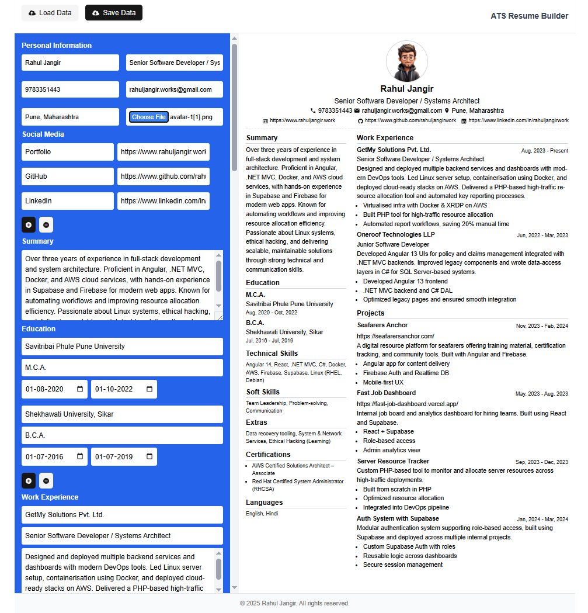

# 🧠 Rahul Jangir Resume Builder

A fast, modern, and highly customizable resume builder built for personal use. It’s designed to help job seekers (like myself!) create clean, professional, and ATS-friendly resumes in minutes. With smart section organization, drag-and-drop functionality, and a minimal UI, this project simplifies resume generation and optimization.

> ✅ Built by Rahul Jangir — Full Stack Developer with 3+ years of industry experience.

---

## 🚀 Live Demo

> 👉 [link here ](https://rahuljangirresume.vercel.app/)



---

## ✨ Features

- ✅ Create ATS-friendly resumes
- 🖱️ Drag-and-drop sections (Work Experience, Projects, Skills, etc.)
- 📄 Export-ready structure for easy copy/paste or PDF formatting
- ⚙️ Configurable and developer-friendly JSON schema


---

## 📋 Sections Supported

- ✅ Personal Information
- ✅ Social Media
- ✅ Summary
- ✅ Education
- ✅ Work Experience
- ✅ Projects
- ✅ Technical Skills
- ✅ Soft Skills
- ✅ Languages
- ✅ Additional Skills
- ✅ Certifications

---

## 📌 Structure

All resume data is stored in a structured JSON file:
```ts
const DefaultResumeData = {
  name: "Rahul Jangir",
  position: "Senior Software Developer / Systems Architect",
  ...
}
